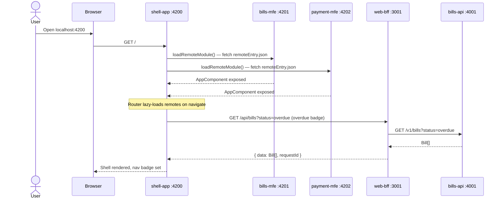
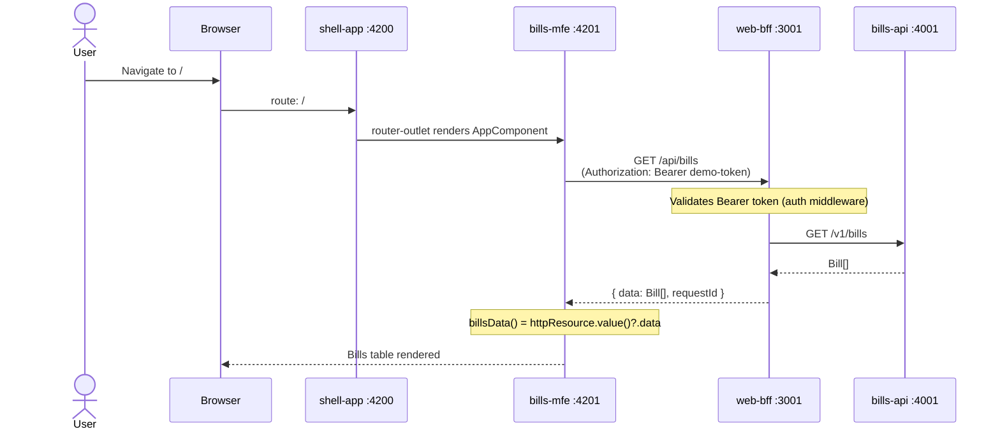
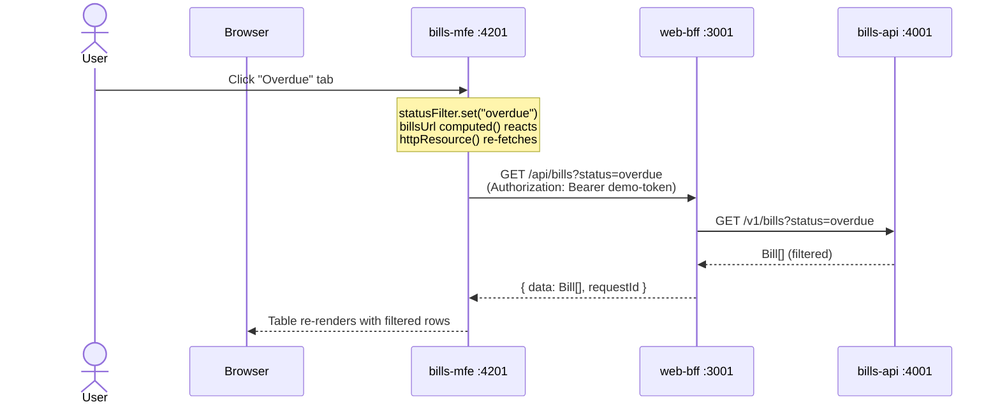
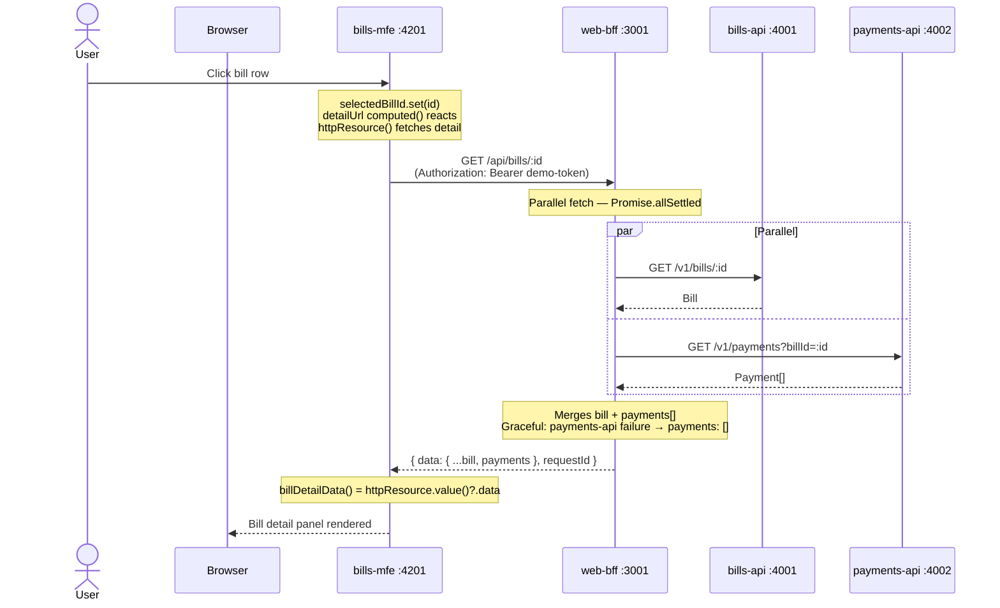
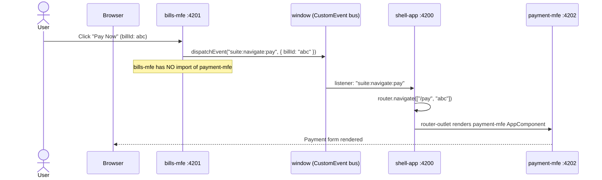
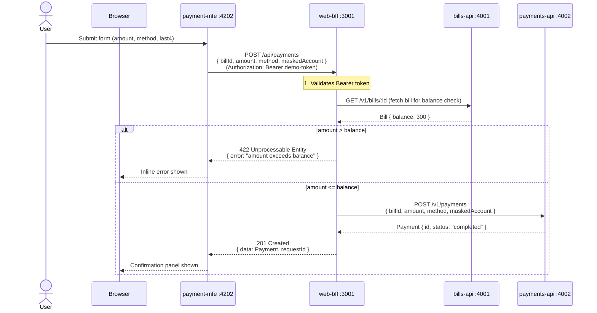
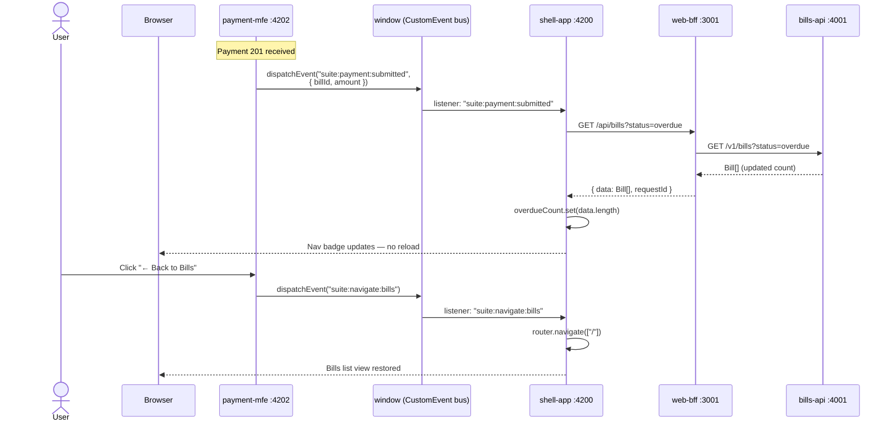
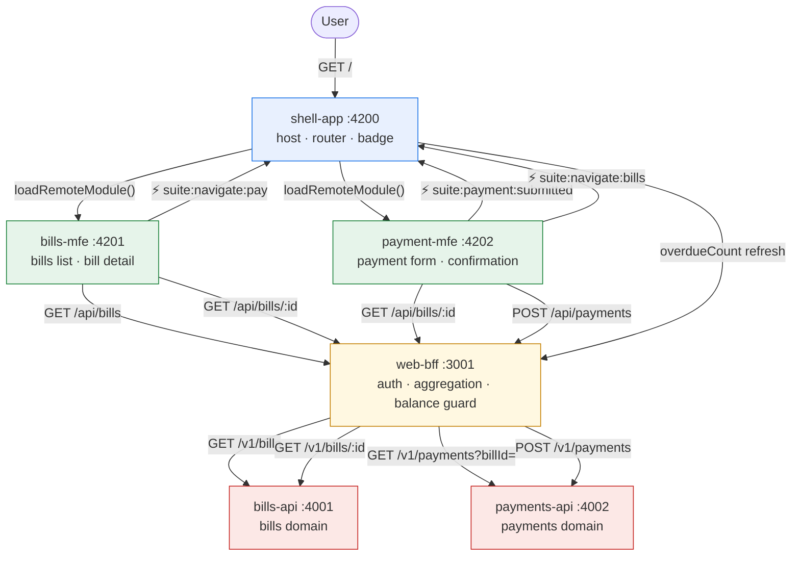

# Navigation Flows — Architecture Reference

Each diagram traces a user interaction from browser to backend, showing every service hop and the pattern that governs it. Ports match the [local dev port assignments](../README.md#port-reference).

**Layer color key used in diagrams:**
- Browser / user action
- `shell-app :4200` — host shell (routing, events, badge)
- `bills-mfe :4201` — Bills micro frontend
- `payment-mfe :4202` — Payment micro frontend
- `web-bff :3001` — Backend for Frontend (auth, aggregation, balance guard)
- `bills-api :4001` — Bills domain API
- `payments-api :4002` — Payments domain API

---

## 1. Application Bootstrap

Shell resolves both remotes at runtime via Native Federation (`loadRemoteModule()`). No npm install, no shared bundle — remotes are loaded from their running dev servers.

**Pattern:** [A2](./suite-architecture-standards.md#a2) — Module Federation host. [A9](./suite-architecture-standards.md#a9) — Remotes never imported as npm packages.

---

## 2. Bills List

User lands on `/`. The shell router-outlet renders bills-mfe, which fetches all bills from the BFF.

**Pattern:** [A3](./suite-architecture-standards.md#a3) — MFE calls BFF only. bills-mfe never calls bills-api directly. [E4](./suite-architecture-standards.md#e4) — Auth validated at BFF; domain APIs receive no tokens.

---

## 3. Filter by Status

User clicks a filter tab (e.g. "Overdue"). bills-mfe recomputes the URL signal and httpResource re-fetches automatically.

**Pattern:** [E3](./suite-architecture-standards.md#e3) — Data at the right granularity; list view requests only summary fields. Signal reactivity — `computed()` drives re-fetch automatically.

---

## 4. Bill Detail — BFF Aggregation

User clicks a bill row. The BFF fans out to two domain APIs in parallel and merges the result into one response.

**Pattern:** [E3](./suite-architecture-standards.md#e3) — 1 BFF call → 2 domain APIs → 1 merged response. [E5](./suite-architecture-standards.md#e5) — Graceful degradation: payments-api down returns `payments: []`, not 500.

---

## 5. Pay Now — Cross-MFE Navigation Event

User clicks "Pay Now". bills-mfe dispatches a `CustomEvent` on `window`. The shell catches it and navigates. The two MFEs never import each other.

**Pattern:** [A9](./suite-architecture-standards.md#a9) — Cross-MFE communication via namespaced `suite:*` CustomEvents. MFEs are fully decoupled; either can be deployed independently.

---

## 6. Payment Form — Submission with BFF Balance Guard

User fills in the payment form and submits. The BFF is the single enforcement point for balance validation — the MFE and payments-api never duplicate this rule.

**Pattern:** [A3](./suite-architecture-standards.md#a3) — Balance guard lives at the BFF. [E4](./suite-architecture-standards.md#e4) — Auth at the BFF boundary. PCI scope: `maskedAccount` carries last 4 digits only — full card data never transits BFF or MFEs.

---

## 7. Payment Confirmation — Badge Refresh via CustomEvent

After confirmation, payment-mfe fires `suite:payment:submitted`. The shell catches it independently and re-fetches the overdue count. No full page reload. No shared state object.

**Pattern:** [A9](./suite-architecture-standards.md#a9) — Shell owns its own state refresh. MFEs communicate intent only — the shell decides how to respond. [E10](./suite-architecture-standards.md#e10) — Every BFF request logged with `correlationId` flowing from shell → BFF → bills-api.

---

## 8. Complete Navigation Map

All paths, all services, all CustomEvents in one view.

---

## Pattern Summary

| Flow | Pattern | Standard |
|------|---------|----------|
| Shell loads MFEs at runtime | Module Federation via `loadRemoteModule()` | A2, A9 |
| MFEs call BFF only | `bffBaseUrl/api/*` — never `localhost:4001` | A3 |
| Auth validated at BFF | Bearer token checked before any domain call | E4 |
| Bill detail merges two APIs | `Promise.allSettled` in BFF route | E3 |
| Payments-api down → `payments: []` | try/catch in BFF, not 500 | E5 |
| Balance guard at BFF | `amount <= bill.balance` in BFF route only | A3 |
| Cross-MFE navigation | `suite:navigate:pay` CustomEvent on `window` | A9 |
| Badge refresh on payment | `suite:payment:submitted` CustomEvent on `window` | A9 |
| Correlation ID on every request | `x-correlation-id` generated/propagated by middleware | A8, E10 |
| BFF response envelope | `{ data, requestId }` — MFEs unwrap with computed signal | E5 |
